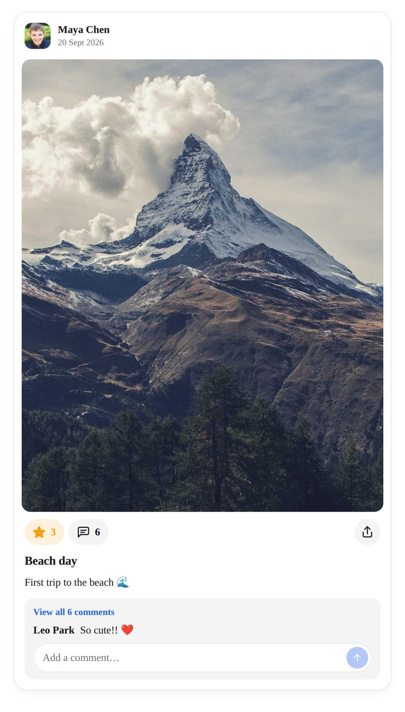
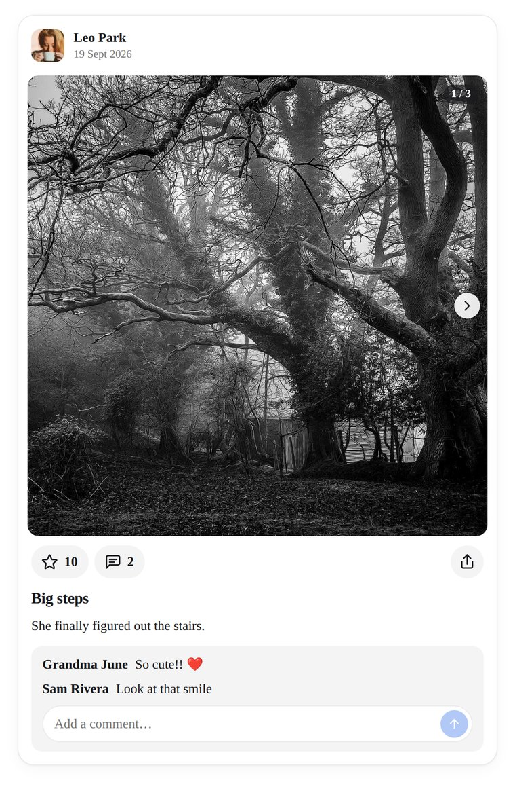
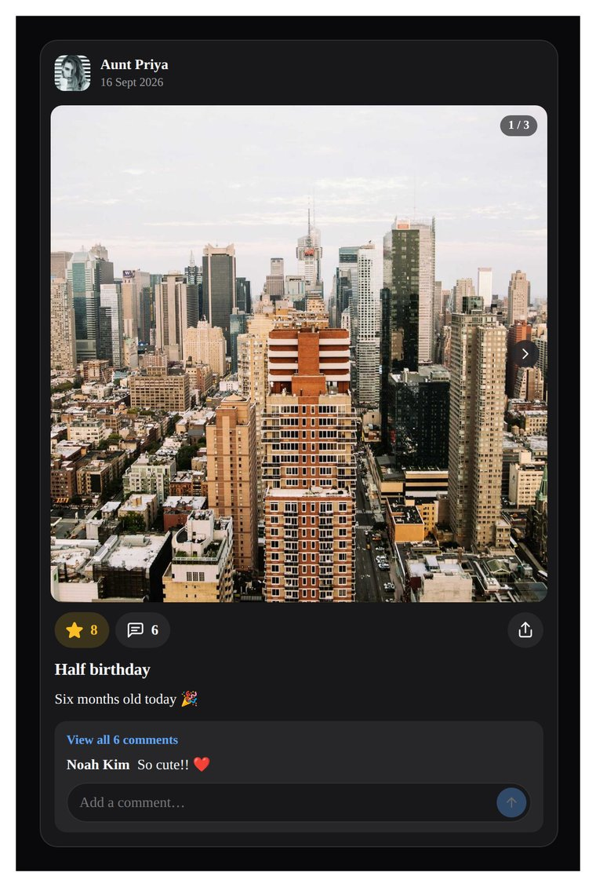
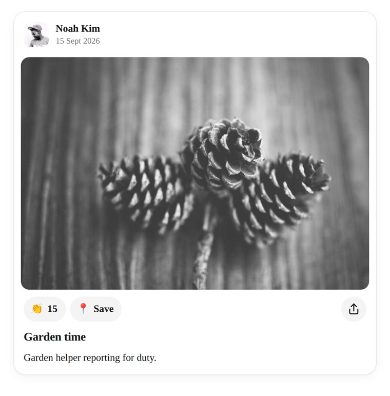
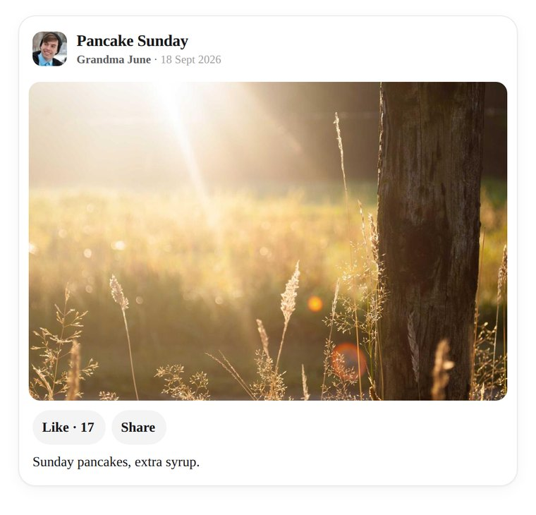
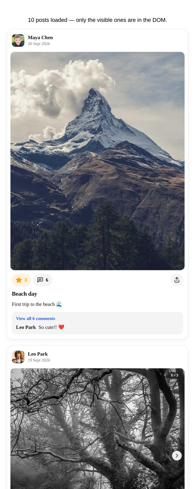

# react-social-feed

[](https://www.npmjs.com/package/react-social-feed)
[](https://github.com/ljmerza/react-social-feed/actions/workflows/ci.yml)
[](LICENSE)

Composable React pieces for social feed posts: header, media carousel, like,
comment and share actions, caption and comments. Use the ready-made `FeedPost`
as-is, or assemble the primitives into whatever layout your app needs. Every
icon can be swapped and you can add your own actions next to the built-in ones.

An optional `react-social-feed/virtual` entry adds `VirtualFeed`, a virtualized
infinite list for long feeds.

No runtime dependencies. React 18.2+ or 19 as a peer. `VirtualFeed` needs
`@tanstack/react-virtual` as well.

<details>
<summary><strong>Screenshots</strong></summary>

<br>

The default `FeedPost`: author, inset photo, action pills with their counts, title, caption, and the comment thread with its input.



Several photos become a swipeable carousel with arrows and a position counter. The whole carousel takes the first photo's aspect ratio.



The bundled dark theme, switched on with a `dark` class on an ancestor.



Icons swapped through the `icons` prop, plus a custom "Save" action built with `PostAction`.



The same primitives rearranged: title in the header, a text like button, and no comments.



`VirtualFeed` against the window scroll, loading ten posts per page. Photo boxes hold their size before the images arrive, so rows don't jump.



</details>

## Installation

```bash
npm install react-social-feed
# only if you use VirtualFeed
npm install @tanstack/react-virtual
```

The package does not import its own CSS. Import the stylesheet once, or skip it
and style the class names yourself:

```tsx
import 'react-social-feed/styles.css';
```

## Quick start

```tsx
import { FeedPost, type SocialPost } from 'react-social-feed';

function Post({ post }: { post: SocialPost }) {
  return (
    <FeedPost
      post={post}
      onLikeChange={(liked) => api.setLiked(post.id, liked)}
      onCommentSubmit={(text) => api.addComment(post.id, text)}
    />
  );
}
```

## Data

Map your API into one `SocialPost` per item:

```ts
interface SocialPost {
  id: string;
  author?: { name: string; avatarUrl?: string; href?: string };
  title?: string;
  caption?: string;
  media: Array<{
    src: string;
    type?: 'image' | 'video';
    alt?: string;
    poster?: string;
    width?: number;   // width + height reserve the box before the file loads
    height?: number;
  }>;
  createdAt?: string | Date;
  likeCount: number;
  liked: boolean;       // has the current viewer liked it
  favorited?: boolean;  // has the current viewer favorited it (private: no count)
  commentCount?: number; // may exceed comments.length when only a preview is loaded
  comments?: Array<{
    id: string;
    author: { name: string };
    text: string;
    createdAt?: string | Date;
    parentId?: string; // replies render one level under their top-level comment
    canDelete?: boolean; // the viewer may delete it (shows the delete button)
  }>;
  shareUrl?: string;
}
```

Pass `width` and `height` for media whenever you have them. In a virtualized
list, that decides whether rows stay put or jump as images load.

The likers list (see [Who liked it](#who-liked-it)) takes the same author shape:
`Array<{ id?: string; name: string; avatarUrl?: string; href?: string }>`.

## Behaviour

Every handler is optional. The state lives in `PostRoot` (which `FeedPost` wraps).

| Prop | What it does |
|---|---|
| `onLikeChange(liked, post)` | The heart updates immediately. Return a promise and a rejection rolls the like back. When the `post` prop changes (a refetch or cache update), local state resyncs from it. |
| `onFavoriteChange(favorited, post)` | Adds the bookmark button to the default action row, next to share. Updates immediately; a rejected promise rolls it back. Favorites are private to the viewer, so the button shows no count. Resyncs from `post.favorited` like likes do. |
| `onCommentSubmit(text, post, { parentId })` | Turns on the comment form and each comment's Reply button. Text arrives trimmed. Resolve to clear the input; reject to keep the draft. Replies carry the top-level comment's `parentId`; a reply to a reply joins that same thread. The form starts a reply by tagging the author (`@Name `). |
| `onCommentDelete(comment, post)` | Shows a delete button on comments with `canDelete: true`. Fires on click; confirm, delete, and update `post.comments` yourself. |
| `onCommentClick(post)` | Replaces the comment button's default of expanding the comments and focusing the input, e.g. to open a modal. |
| `onCommentsExpandedChange(expanded, post)` | Fires on the first "Show more" (`true`) and on collapsing (`false`), so you can fetch the full thread. See [Showing more comments](#showing-more-comments). |
| `onShare(post)` | Custom share. Without it the button uses the Web Share API with `post.shareUrl`, falls back to copying the link, and is disabled when there is no URL. |
| `defaultCommentsExpanded` | Start one "Show more" step in: the full list without `pageSize`, the preview plus one page with it. |
| `commentPage`, `defaultCommentPage`, `onCommentPageChange(page, post)` | The comment reveal position: how many "Show more" steps have been taken (0 = preview, `Infinity` = everything). Pass `commentPage` to control it. |
| `onLikeLongPress(post)` | Turns on long-press (and Shift+Enter) on the like button and fires when it happens. The press doesn't toggle the like. See [Who liked it](#who-liked-it). |
| `likersOpen`, `defaultLikersOpen`, `onLikersOpenChange(open, post)` | Open state of the likers list, controlled or not. `onLikersOpenChange` also turns on long-press. |
| `shareStatusResetMs` | How long `'shared'`/`'copied'`/`'error'` stays before resetting. Default 2000. |

Double-tapping or double-clicking the media likes the post and plays a short
burst animation. It never unlikes. Turn it off with `<PostMedia likeOnDoubleTap={false} />`.

A playing video pauses once less than a quarter of it is visible: scrolled out
of view (window or any scroll container) or its carousel slide swiped away. It
never resumes on its own and nothing autoplays. Fullscreen and picture-in-picture
playback are left alone. Turn it off with `<FeedPost pauseVideosWhenHidden={false} />`
or `<PostMedia pauseWhenHidden={false} />`. Browsers without IntersectionObserver
just skip it.

Only one video plays at a time. When a video starts, any other video the library
rendered that is still playing pauses, whether it sits in the same carousel or
in another post. Nothing is resumed or started. A video shown fullscreen or in
picture-in-picture keeps playing when another one starts, while a video started
in fullscreen does pause the others. Turn it off with
`<FeedPost pauseOtherVideosOnPlay={false} />` or `<PostMedia pauseOthersOnPlay={false} />`.
A video with it off is left out both ways: it doesn't pause others and they
don't pause it.

### `usePauseWhenHidden`

The same behaviour for a video you render yourself, e.g. through
`PostMedia`'s `renderItem`:

```tsx
import { useRef } from 'react';
import { usePauseWhenHidden } from 'react-social-feed';

function MyVideo({ src }: { src: string }) {
  const ref = useRef<HTMLVideoElement>(null);
  usePauseWhenHidden(ref, {
    threshold: 0.25, // pause below this visible fraction
    enabled: true
  });
  return <video ref={ref} src={src} controls playsInline />;
}
```

The element is read when the component mounts, so keep the same `<video>` for
the component's lifetime.

### `usePauseOthersOnPlay`

Adds a video you render yourself to the one-at-a-time group. Combine it with
`usePauseWhenHidden` to match the built-in videos:

```tsx
import { useRef } from 'react';
import { usePauseOthersOnPlay, usePauseWhenHidden } from 'react-social-feed';

function MyVideo({ src }: { src: string }) {
  const ref = useRef<HTMLVideoElement>(null);
  usePauseWhenHidden(ref);
  usePauseOthersOnPlay(ref, { enabled: true });
  return <video ref={ref} src={src} controls playsInline />;
}
```

The group covers every element using the hook on the page, built-in videos
included, with no provider needed. Leave muted background loops out of it:
starting a video would pause them, and they would pause the viewer's video when
they start.

## Who liked it

Long-pressing the like button (about half a second, mouse or touch) opens the
list of likers instead of toggling the like. A normal tap still likes, and
double-tapping the media still likes. Pass `onLikeLongPress` or
`onLikersOpenChange` to turn it on, then render `PostLikers` wherever you like:
a dialog, a popover, a bottom sheet, or inline under the actions.

```tsx
import { FeedPost, PostLikers } from 'react-social-feed';

const [likersOpen, setLikersOpen] = useState(false);

<FeedPost post={post} likersOpen={likersOpen} onLikersOpenChange={setLikersOpen} />
<MyDialog open={likersOpen} onClose={() => setLikersOpen(false)} title="Liked by">
  <PostLikers post={post} loadLikers={(post) => api.likers(post.id)} />
</MyDialog>
```

`PostLikers` fetches on mount with `loadLikers(post)`, so rendering it only while
open means you only fetch when someone asks. If you fetch yourself (e.g. with
TanStack Query), pass `likers`, `loading`, `error` and `onRetry` instead. Inside a
`PostRoot` it reads the post from context; elsewhere pass `post`.

| `PostLikers` prop | What it does |
|---|---|
| `loadLikers(post)` / `likers` | Where the list comes from. `likers` wins when both are set. |
| `loading`, `error`, `onRetry` | Loading/error state for `likers` you fetch yourself. Retry defaults to calling `loadLikers` again. |
| `renderLiker(liker, index)` | Replaces each row's content (still inside an `<li>`). `PostLiker` is the default row. |
| `renderLoading()`, `renderEmpty()`, `renderError(error, retry)` | Replace a whole state. |
| `loadingLabel`, `emptyLabel`, `errorLabel`, `retryLabel`, `listLabel` | Change the default text (defaults: "Loading…", "No likes yet", "Couldn't load likes", "Try again", and "Liked by" as the list's accessible name). |
| `children(state)` | Render everything yourself from `{ likers, status, error, retry }`. `usePostLikers(options)` gives you the same state without the component. |

The wrapper carries `data-status` (`loading`, `error`, `empty` or `ready`) and
`aria-busy` while loading.

`PostLikeButton` tunes the gesture with `longPress`: leave it unset to follow the
root, pass `false` to turn it off, `true` to force it on (it then just flips
`likersOpen`), or `{ delay, moveTolerance, keyShortcut }` (defaults 500ms, 10px,
`'Shift+Enter'`). While a press is held the button gets `data-pressing`.

**Accessibility.** A long press can't be done from a keyboard or a screen
reader, so the like button also opens the likers with **Shift+Enter**. It
announces the shortcut with `aria-keyshortcuts` and a hint through
`aria-description` ("Long press or press Shift+Enter to see who liked this";
change it with `likersHint`, or `false` to drop it). For a visible way in, add
your own button that calls `openLikers` from `usePostContext()`, e.g. on the
like count:

```tsx
function LikersLink() {
  const { likeCount, openLikers } = usePostContext();
  return <button onClick={openLikers}>{likeCount} likes</button>;
}
```

### `useLongPress`

The hook behind the like button, for any element:

```tsx
import { useLongPress } from 'react-social-feed';

const { longPressProps, isPressing } = useLongPress({
  onLongPress: () => openMenu(),
  onPress: () => openPhoto(), // a normal click
  delay: 500,                 // ms
  moveTolerance: 10,          // px of drift before it cancels
  keyShortcut: 'Shift+Enter', // keyboard alternative; false turns it off
  disabled: false
});

<div role="button" tabIndex={0} className="rsf-long-press" {...longPressProps}>…</div>
```

It uses Pointer Events, so mouse, touch and pen all work. The click that ends a
long press is swallowed, so `onPress` doesn't run too. Moving past
`moveTolerance`, leaving the element, a cancelled pointer, or scrolling cancels
the press. The context menu is suppressed only while a press is held. Add the
`rsf-long-press` class (from `styles.css`) or the same CSS yourself
(`-webkit-touch-callout: none; user-select: none`) to stop the iOS callout and
text selection. If you have your own handlers for the same events, call both.

## Icons and custom actions

Every built-in icon comes from one table. Override any subset on `PostRoot` (or
`FeedPost`), or wrap a whole feed in `PostIconsProvider` to theme every post at
once:

```tsx
import { FeedPost, PostIconsProvider } from 'react-social-feed';
import { Heart, MessageCircle, Send } from 'lucide-react';

<FeedPost post={post} icons={{ like: <Heart />, liked: <Heart fill="currentColor" /> }} />

<PostIconsProvider icons={{ comment: <MessageCircle />, share: <Send /> }}>
  {posts.map((post) => <FeedPost key={post.id} post={post} />)}
</PostIconsProvider>
```

Keys: `like`, `liked`, `favorite`, `favorited`, `comment`, `share`, `send`, `previous`, `next`, `burst`, `remove`.

`PostAction` is the button every built-in action is made of. Use it for your
own actions so they match, and read post state with `usePostContext()`:

```tsx
import { PostAction, PostActions, PostActionSpacer, PostLikeButton, PostShareButton, usePostContext } from 'react-social-feed';

function DownloadAction() {
  const { post } = usePostContext();
  return (
    <PostAction aria-label="Download" icon={<DownloadIcon />} onClick={() => download(post.media)}>
      Save
    </PostAction>
  );
}

<PostActions>
  <PostLikeButton />
  <DownloadAction />
  <PostActionSpacer />
  <PostShareButton />
</PostActions>
```

## Composing your own layout

Every piece reads from the nearest `PostRoot`, so you can reorder, drop or
replace any of them:

```tsx
import {
  PostRoot, PostHeader, PostAvatar, PostAuthor, PostTimestamp, PostTitle,
  PostMedia, PostActions, PostLikeButton, PostShareButton, PostCaption
} from 'react-social-feed';

<PostRoot post={post} onLikeChange={setLiked}>
  <PostHeader>
    <PostAvatar />
    <div>
      <PostTitle as="h2" />
      <PostAuthor /> · <PostTimestamp format={(d) => d.toLocaleDateString()} />
    </div>
  </PostHeader>
  <PostMedia aspectRatio="16 / 9" />
  <PostActions>
    <PostLikeButton>{({ liked, likeCount }) => `${liked ? 'Liked' : 'Like'} · ${likeCount}`}</PostLikeButton>
    <PostShareButton>{({ status }) => (status === 'copied' ? 'Link copied' : 'Share')}</PostShareButton>
  </PostActions>
  <PostCaption />
</PostRoot>
```

| Primitive | Renders |
|---|---|
| `PostRoot` | `<article>` plus the context. Takes `icons`. Children may be a function of the post state. |
| `PostHeader` | Avatar, author and timestamp by default. |
| `PostAvatar`, `PostAuthor`, `PostTimestamp`, `PostTitle` | The individual header parts. `PostTitle` accepts `as`. |
| `PostMedia` | Scroll-snap carousel. Props: `aspectRatio`, `renderItem`, `likeOnDoubleTap`, `loading`, `pauseWhenHidden`, `pauseOthersOnPlay`. |
| `PostMediaItem`, `PostMediaPrevButton`, `PostMediaNextButton`, `PostMediaCounter`, `PostMediaIndicators` | Carousel parts. The default overlay is arrows plus a "2 / 5" counter; `PostMediaIndicators` draws dots instead. Pass children to `PostMedia` to replace the overlay. |
| `PostActions` | Like, comment and (pushed to the end) favorite and share by default. Favorite only appears when the root has `onFavoriteChange`. |
| `PostAction`, `PostActionSpacer` | The shared action button, and a spacer that pushes later actions to the end. |
| `PostLikeButton`, `PostCommentButton` | Icon plus count (`showCount={false}` hides it). Render-prop children replace both. The like button long-presses to open the likers (`longPress`, `likersHint`). |
| `PostFavoriteButton` | Bookmark toggle, icon only, `aria-pressed`. `label(favorited)` sets the accessible name (default "Add to favorites"/"Remove from favorites"); render-prop children get `{ favorited }`. |
| `PostShareButton` | Icon only. Render-prop children get the share status. |
| `PostLikeCount` | A separate "N likes" line for layouts that hide the count on the button. `format(count, liked)`; return `null` to hide. |
| `PostCaption` | Caption. `showAuthor` puts the author's name in front. |
| `PostComments` | The newest `previewCount` comments plus a "Show more" control (all at once, or `pageSize` at a time) and "Hide comments", with replies nested one level under their top-level comment. See [Showing more comments](#showing-more-comments). |
| `PostComment` | A single comment row, with a Reply button when commenting is on and a delete button when the comment is deletable. |
| `PostCommentForm` | Input and send button, plus a "Replying to Name · Cancel" line while replying (Escape also cancels). Renders nothing without `onCommentSubmit`. |
| `PostLikers` | The list of who liked the post, with loading, empty and error states. Doesn't need a `PostRoot` if you pass `post`. See [Who liked it](#who-liked-it). |
| `PostLiker` | A single likers row: avatar (or initials) and name, linked when `href` is set. |

To drop the `<article>` wrapper, call `usePostState(options)` yourself and pass
the result to `PostContextProvider`. `usePostContext()` gives any custom
component the same state the primitives use.

Visible and accessible strings (`"Like"`, `"View all N comments"`,
`"Add a comment…"`) can be replaced through props (`label`, `viewAllLabel`,
`showMoreLabel`, `placeholder`, `submitLabel`, `format`, `aria-label`, …), which
is how you plug in i18n.

### Showing more comments

`PostComments` shows the newest `previewCount` comments (default 2). Without
`pageSize`, one click on "View all N comments" shows the rest, as before. With
`pageSize`, each click on "View more comments (N)" reveals that many earlier
comments, and "Hide comments" goes back to the preview:

```tsx
<PostComments
  previewCount={3}
  pageSize={5}
  showMoreLabel={(remaining, total) => t('comments.more', { count: remaining })}
  hideLabel={t('comments.hide')}
  loadingLabel={t('comments.loading')}
/>
```

- **Threads stay whole.** Comments are counted, but a reply is never shown
  without its top-level comment or the other way round, so a click may reveal a
  few more than `pageSize` to finish a thread. Threads are revealed newest
  activity first and listed oldest first. A reply whose top-level comment isn't
  loaded shows on its own.
- **Previews.** When `commentCount` is higher than `comments.length`, the first
  click fires `onCommentsExpandedChange(true)` so you can load the full thread
  into `post.comments`. Until it grows, the control is hidden, or shows
  `loadingLabel` if you pass one. Paging picks up once the comments arrive.
- **Customizing.** `showMorePosition="end"` moves the control below the list.
  `renderShowMore(reveal)` and `renderHide(reveal)` replace the controls
  outright. The buttons carry `rsf-post__comments-toggle` plus a `--more` or
  `--hide` modifier; the loading text is `rsf-post__comments-loading`.
- **Headless.** `usePostCommentReveal({ previewCount, pageSize })` returns what
  `PostComments` renders from: the visible `comments`, `visibleCount`,
  `totalCount`, `remainingCount`, `loadedCount`, `page`, `canShowMore`,
  `isLoadingMore`, `canCollapse`, `showMore()` and `collapse()`. The step count
  itself (`commentPage`, `setCommentPage`, `showMoreComments`) lives in the post
  state, so every component in a post shares it.

## Virtualized feed

```tsx
import { FeedPost } from 'react-social-feed';
import { VirtualFeed } from 'react-social-feed/virtual';

const { data, fetchNextPage, hasNextPage, isFetchingNextPage } = useInfiniteQuery(/* … */);
const posts = data?.pages.flatMap((page) => page.results) ?? [];

<VirtualFeed
  items={posts}
  getItemKey={(post) => post.id}
  renderItem={(post) => <FeedPost post={post} />}
  hasMore={hasNextPage}
  isLoadingMore={isFetchingNextPage}
  onLoadMore={fetchNextPage}
  renderEnd={() => <p>You're all caught up</p>}
  renderEmpty={() => <p>No posts yet</p>}
  aria-label="Photo feed"
/>;
```

Rows are measured after they render, so posts can be any height. `estimateSize`
(default 600px) only affects the first frame. By default the list follows the
window scroll. Pass `getScrollElement={() => ref.current}` to scroll inside an
overflow container instead. Other props: `overscan` (default 3), `gap`,
`loadMoreThreshold` (how many items from the end to start loading, default 3),
`renderLoader` and `scrollMargin`.

`VirtualFeed` renders anything, not just posts. `renderItem` can return any node.

## Styling

`styles.css` is plain CSS driven by custom properties. Override tokens instead
of rewriting rules:

```css
:root {
  --rsf-color-like: #e11d48;
  --rsf-color-favorite: #0d9488;
  --rsf-post-max-width: 600px;
  --rsf-media-inset: 0;   /* edge-to-edge photos */
  --rsf-media-fit: contain;
  --rsf-comment-gap: 1rem; /* space between comments and replies */
  --rsf-likers-gap: 0.75rem; /* space between likers */
  --rsf-likers-avatar-size: 40px;
  --rsf-likers-max-height: 50vh; /* scroll long lists (default: none) */
}
```

A `.dark` block ships with the stylesheet and re-points those tokens. It keys off
a `dark` class on an ancestor, so the consuming app decides when to switch.
Every element uses a `rsf-` BEM class, and every primitive accepts `className`.
The likers list is its own `rsf-likers` block (`__list`, `__item`, `__avatar`,
`__name`, `__status`, `__retry`), since it usually renders outside the post.

## Development

```bash
npm install
npm run storybook   # http://localhost:6006
```

| Script | Purpose |
|---|---|
| `npm test` | Vitest suite |
| `npm run test:coverage` | Tests with coverage |
| `npm run lint` | ESLint |
| `npm run typecheck` | `tsc --noEmit` |
| `npm run build` | ESM + CJS bundles for both entries, plus declarations |

## Releasing

CI runs tests on every PR. To release: bump `version` in `package.json`, merge,
then tag.

```bash
git tag v1.2.3 && git push origin v1.2.3
```

The tag publishes to npm via [trusted publishing](https://docs.npmjs.com/trusted-publishers/)
(OIDC, no stored token) and creates a GitHub release. The build fails if the tag
and `package.json` version disagree.

## License

MIT
